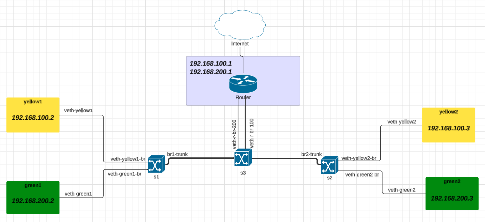
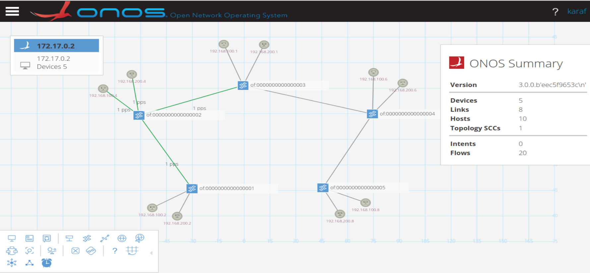

<<<<<<< HEAD
# Network Configuration Description

The Python script utilizes the Mininet library to create a custom network topology simulating VLANs and a router. The topology consists of three switches (s1, s2, s3) and a Linux-based router (router). Hosts are connected to switches and VLANs are configured to facilitate inter-VLAN routing.

## Switch Configuration

- `s1` and `s2` are edge switches connected to hosts (`h1`, `h2` on `s1` and `h3`, `h4` on `s2`).
- `s3` acts as a central switch connecting `s1`, `s2`, and the router (`router`).

## Router Configuration

The router is configured with VLAN sub-interfaces:
- `router-eth0.100` for VLAN 100 (192.168.100.1/24).
- `router-eth0.200` for VLAN 200 (192.168.200.1/24).

Static routes are added on the router to enable communication between VLANs (192.168.100.0/24 and 192.168.200.0/24).

## Host Configuration

Four hosts (`h1`, `h2`, `h3`, `h4`) are assigned IP addresses within their respective VLANs:
- 192.168.100.2/24 for VLAN 100
- 192.168.200.2/24 for VLAN 100
- 192.168.100.3/24 for VLAN 200
- 192.168.200.3/24 for VLAN 200

## VLAN Configuration

- VLAN trunking is configured between switches (`s1` to `s3` and `s3` to `s2`) using Open vSwitch commands (`ovs-vsctl`).
- VLAN tags are removed from trunk ports to allow them to carry traffic from multiple VLANs.

## Implementation Details

- The script utilizes Mininet's `Topo` and `Node` classes to define the network topology and custom router behavior.
- Remote controller (`c0`) is specified to manage network traffic.

## Testing and Verification

- **Ping and iperf Measurements:** Reported ping and iperf measurements to verify connectivity and performance between hosts in different VLANs.

- **ONOS Web-GUI:** Visualized and checked the topology on the ONOS web-GUI to ensure the network configuration and connectivity were correctly visualized and managed.

This configuration enables us to explore and demonstrate practical aspects of network segmentation, VLAN tagging, and routing within a simulated environment leveraging Mininet's capabilities effectively.

## Images

### Image 1: Network Topology

### Image 2: ONOS Web-GUI

=======

[README.md](https://github.com/user-attachments/files/16373117/README.md)
>>>>>>> 50c2c46 (Update README.md)
